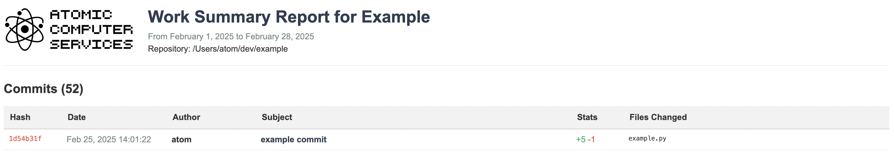

# RepoReport

A simple command-line tool written in Go that generates HTML reports of git commit history within a specified date range.

## Features

- Generate HTML reports of commit history with commit details
- Filter commits by date range
- Include company branding (name and logo)
- View commit details including author, date, message, and changed files
- Tabular view for easy reading and comparison
- Automatic file naming based on date and company

## Installation

1. Clone this repository
2. Make sure you have Go installed (1.16 or later recommended)
3. Build the tool:

```bash
go build -o reporeport main.go
```

## Screenshot



## Usage

Basic usage:

```bash
./reporeport -start "2023-01-01" -end "2023-12-31" -company "Acme Corp" -repo "/path/to/repository"
```

This will generate a file named `2023-12-31-Acme-Corp-report.html` in the current directory.

### Command Line Arguments

| Flag | Description | Default | Required |
|------|-------------|---------|----------|
| `-start` | Start date (YYYY-MM-DD) | | Yes |
| `-end` | End date (YYYY-MM-DD) | | Yes |
| `-repo` | Path to git repository | Current directory | No |
| `-company` | Company name | "Company" | No |
| `-logo` | Path to company logo image | | No |
| `-output` | Custom output file path | YYYY-MM-DD-COMPANY-report.html | No |

### Examples

Generate a report for a specific repository with company branding:

```bash
./git-report -start "2023-01-01" -end "2023-03-31" -company "Acme Corp" -repo "/path/to/repo" -logo "/path/to/logo.png"
```

Generate a report with a custom output filename:

```bash
./git-report -start "2023-01-01" -end "2023-03-31" -output "quarterly-report-q1.html"
```

## Customization

The HTML template is stored in `templates/report.html`. You can modify this file to customize the appearance of the generated reports.

## Requirements

- Go 1.16 or later
- Git installed and accessible from command line
